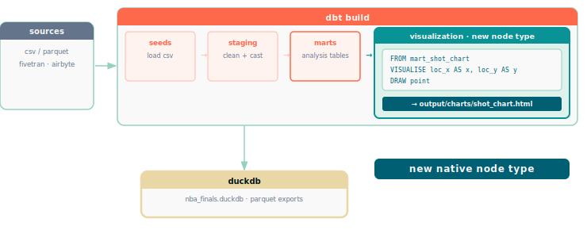

# dbt + ggsql · native visualization node · posit hackathon 2026

dbt knows four node types: sources, seeds, models, and tests. When a pipeline needs a chart, it stops — the data hands off to a BI tool, a post-hook script, or a separate render step. That boundary is where SQL engineers leave the pipeline.

This repo asks: what if visualization were a fifth node type?



## what this is

A fork of **dbt-core v1.11.11** that adds `NodeType.Visualization` to the graph. Place `.ggsql` files in a `visualizations/` folder and `dbt build` runs them alongside your models — executing each query through the [ggsql](https://github.com/posit-dev/ggsql) kernel and writing a self-contained HTML chart to `output/charts/`.

```
nba_finals.visualization.shot_chart_knicks_cavs
```

That node appears in `dbt ls`, participates in `dbt build`, and respects `--select` like any other node. The chart it produces lands next to your mart tables as a pipeline artifact.

## the change

Twelve files in dbt-core carry the new node type. The key ones:

| file | change |
|---|---|
| `artifacts/resources/types.py` | adds `NodeType.Visualization` to the enum |
| `contracts/graph/nodes.py` | defines `VisualizationNode` |
| `runners/visualization_runner.py` | executes ggsql, wraps output in HTML |
| `task/build.py` | registers the runner in `RUNNER_MAP` |
| `parser/visualization.py` | parses `.ggsql` files from `visualizations/` |
| `config/project.py` | adds `visualization_paths` project config |

The runner calls `ggsql run <file>`, captures the Vega-Lite JSON from stdout, and wraps it in a self-contained HTML page with the Vega-Lite CDN — the same approach the ggsql CLI uses.

## quick start

```bash
cd nba_dbt
uv sync --python 3.13

# list visualization nodes
uv run dbt ls --profiles-dir . --project-dir . --resource-type visualization

# build one
uv run dbt build --profiles-dir . --project-dir . --select shot_chart_knicks_cavs

open output/charts/shot_chart_knicks_cavs.html
```

**requires:** ggsql CLI (`cargo install ggsql-cli`), Python 3.13, uv

## the bigger question

dbt likely has 200,000+ active practitioners. Most of them already know SQL. The handoff to a BI tool is a learned behavior, not a technical requirement — the data is ready, the query is written, the chart is one keyword away.

Whether visualization belongs natively in dbt is a question for the dbt community. This repo is a proof of concept: **twelve files, one new node type, no BI tool.**

## related

**[dbtggsql-demo](https://github.com/icarusz/dbtggsql-demo)** — the original project, using hooks and the ggsql CLI with three output modes (individual charts, static bundle, full Quarto report).
